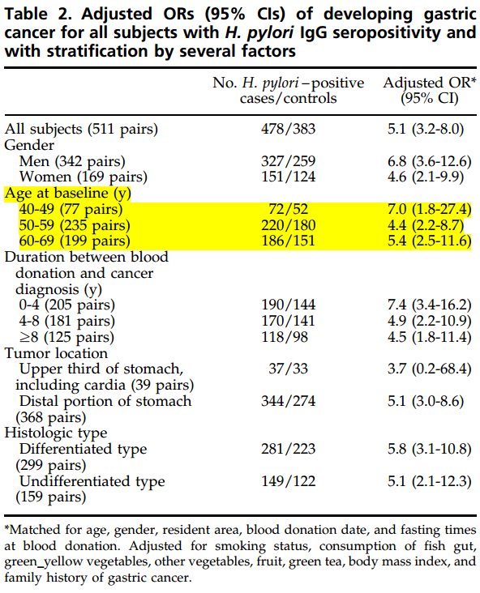

class: center, middle

# METHODS


???

では，これから解析の方法を詳しく説明していきたいと思います．どうぞよろしくお願いいたします．

---
class: middle

## Data extraction (1)


+ 43 papers  <br>
   $+$ JPHC Cohort II <br>
   $+$ JPHC-NEXT Cohort Study <br>
   included for meta-regression analysis [(Table 1)(←click here)](http://rpubs.com/winterwang/288338).

+ Prevalence of _H. pylori_ infection reported by birth year group of participants<sup>[1~7]</sup>.

    1. Ueda J. **_Helicobacter._** 2014;
    1. Watanabe M. **_Cancer Sci._** 2015;<br>
    1. Reploge M.L. **_Int J Epidemiol._** 1996;
    1. Shimoyama T. **_Gastric Cancer._** 2012;<br>
    1. Shimatani T. **_J Gastroenterol Hepatol._** 2005;
    1. JPHC Cohort II;
    1. JPHC-NEXT


???

+ まずは，meta regressionに入れようと思った論文を集めたら，
+ その次は，解析用のデータセットを作ります．
+ 今回は，過去の研究合計４３件を解析用に決めて，その後井上先生のおかげで，JPHC Cohort II 及び JPHC NEXTのデータを加えることができました．
+ それぞれ研究の詳細と特徴は，テーブル1 にまとめましたので，ここをクリックして確認ができます．
+ これら研究のデータの抽出は，いくつかの場合があります．
+ 最も簡単なのは，論文の中から出生年別の感染率データが直接報告されていた場合，そのまま使います．以下の７件はこの状況です．


---
class: middle


## Data extraction (2)

+ 38 studies reported prevalence with age groups.
  - 34 studies reported data collection period:

      - Example:
           + 60-70 years old group;
           + data collection done in 1990;
           + birth year should be 1920~1930.

  - 4 studies reported age groups with **data collection year unavailable**, year of publication was used instead of data collection period.

+ The results of risk of bias diagnosis is available [here(←click)](http://rpubs.com/winterwang/riskofbias)

???

+ 残り３８件の先行研究は，また更に，２種類の状況があります．
+ 一つ目は，研究実施の年と各年齢グループの感染率が報告されていると，
+ 二つ目の場合は，各年齢グループのピロリ感染率が報告されているが，そのサンプリングを実施した年がはっきり書かれていない状況であります．
+ 一つ目の状況の場合は３４件の研究がありました．ここで挙げた例で説明します，
+ 例えば，報告された６０－７０歳の対象者ｎ人の感染率が測定されました，それから，対象者の血液または尿などの検体は１９９０年に回収されたと報告があり，この60代の対象者の出生年は当然1920年から1930年の間であることがわかります．
+ 一方，最後の４件の研究は，研究実施に関する具体的な時間情報がなく，仕方なく，その該当論文の出版した年を研究実施年としてimputationしました．もちろん，この場合は，誤差が生じることがありますので，ご注意をお願いします．

---

### Data extraction example (Study No. 12)
#### _rules are decided by researchers_
Sasazuki, S. et al. **_Cancer Epidemiol Biomarkers Prev_** 15, 1341–1347 (2006).

.pull-left[

]

.pull-right[
+ Control samples of this study (JPHC I/II) were collected during 1990-1993.<br><br>⇒ 1990 (the earlier one) used as the year of research

+ Birth year groups:
    - 40-49 ⇒ 1941-**1950**
    - 50-59 ⇒ 1931-**1940**
    - 60-69 ⇒ 1921-**1930**
    - Many studies reported no upper limit of age (e.g. 70 or older) ⇒ **1920**
]

???

+ ここで，もう一つ実例を挙げて説明したいと思います．

+ 例えば，これは笹月先生の論文からデータ抽出の例です．

+ ほとんどの場合，こういったデータは，論文の中にあるテーブルにまとめました．

+ この研究では，実施時期は1990年から1993年までですが，より早い1990を研究年として扱われることにしました．

+ 出生年については，ここ書いたように，４０－４９歳の人は，研究実施の1990から計算すると，1941-1950年生まれということになりました．

+ この論文はちょうど69歳まで，きれいに年齢を切ったので，早いと遅い年どちらでも算出可能です．しかし，

+ ほかにもっと多い研究では，高齢者の場合，90歳以上，80歳以上など，一番年寄りの年齢が書かれていない場合がほとんどですので，その時，最も早い出生年の計算ができないです．例えば，もしここに1990年に血液検査を受けた70歳以上の受診者の感染率データがあるとして，出生年は1920年より前でしかわからないです．ですので，より多くデータを入れるためにも，統一するためにも，いろいろ考えたら，グループの出生年が遅いほうを採用して，そのグループの出生年として解析を進めることにしました．

---

### 273 Data Points from 45 Studies were available for meta-regression

```{r eval=require('DT'), tidy=FALSE, echo=FALSE, warning=FALSE}
com_data <- read.csv("complete_data.csv")
datatable(
  com_data, rownames=FALSE,
  extensions = list(Scroller=NULL,  FixedColumns=list(leftColumns=2)),
  options = list(
    dom = 'T<"clear">lfrtip',
    columnDefs = list(list(width = '20%', targets = list(2,3,4))),
    deferRender=TRUE,
    scrollX=TRUE,scrollY=400,
    scrollCollapse=TRUE,
    pageLength = 100, lengthMenu = c(10,50,100,200,300)
  )
)
```

???

+ 合計４５件研究から，２７３個のデータポイントを抽出することができました．
+ 詳細はこちらの表で示しています．
+ 先程笹月先生の論文の例を出して見たら，さっきの計算結果と一緒のことがわかります．


---
class: center, middle

# STATISTICAL ANALYSIS

???

- データ・セットの準備ができましたら，次は実際にRの中では，解析の過程をこれからステップずつ示していきます．
- 必要なパッケージや，詳細なプログラムを載せましたので，コピーして先生方もご自分のパソコンで再現できます．


---

class: middle

## Step 1: Data Point Weight Calculation

```{r, eval=FALSE}
library(meta)

library(metafor)

library(mgcv)


meta <- metaprop( event = Number_of_Positive,
                  n     = Number_of_Subjects_in_the_corresponding_group,
                  byvar = Birth_Year,
                  sm    = "PLOGIT",    # Logit transformation
             method.tau = "REML")      # Restricted Maximum-likelihood
                                       # estimator to estimate the
                                       # between-study variance


weight<-meta$w.random # Weight of each data point extracted
```

???

ステップ１です．各データポイントのサンプルサイズにより，それぞれのウェイトを計算しないとだめですので，metapropという函数を使って計算ができます．

最初使うパッケージを宣言してから，パッケージに入っている函数が使えるようになり，
パラメータは左側に書いたように，指定してウェイトを計算します．


---
class: middle

## Step 2: Meta-regression (Generalized Additive Mixed Model, GAMM)

```{r, eval=FALSE}
########################   MODEL 1  ###############################
res1 <- gam(cbind(event,n) ~ s(Birth_Year, bs="cr") +
                        # Cubic Spline Regression 三次スプライン曲線
s(Study_ID, bs="re") +  # Study ID as random effect

Source_of_population +  # Community OR Clinical based

Specimen_type        +  # Serum OR Others (urinary, salivary, stool, biopsy)

Kit.from             +  # Antigen derived from demostic or foreign

early,                  # Data collection period, cutoff = 2000

data = data, weights=weight,

family="binomial"(link=logit), method="REML")
```

???

ステップ２では，一般加法混合モデル，いわゆるGAMMを使って，meta-regression をします．

具体的に言いますと，GAMMモデルの作り方はこちらのようです：
1. 出生年を三次曲線に仮定し，４５件の研究から２００個以上のデータを抽出したため，複数のデータポイントが同じ研究からであり，お互いに独立ではないので，IDを基づき調整する必要があります．
2. この２つパラメータがとても重要ですので，後は普通の線形モデルみたいに，入れたい共変量を入れるだけです．
3. 例えば，ここでは，最初のモデルとして，サンプリングの由来としてSource_of_populationを入れました，それから，測定用の検体の種類，血清とそれ以外に２群に分けて調整し，測定の抗原は日本国内か国外からかも調整し，最後に研究実施の時期が2000年前か後かを区別する変数も入れて，モデル１が完成しました．

---

#### Summary from Model 1 comparable to [Table 3 ← click here](http://rpubs.com/winterwang/table3)
```{r, echo=FALSE, message=FALSE, warning=FALSE}
library(meta)
library(metafor)
library(mgcv)
library(epicalc)

com_data <- read.csv("complete_data.csv")
com_data$kit.from <- as.character(com_data$kit.from)
com_data$kit.from[is.na(com_data$kit.from)] <- "unknown"
com_data$kit.from[com_data$kit.from=="domestic "] <- "domestic"
com_data$kit.from <- as.factor(com_data$kit.from)
#table(com_data$kit.from)
com_data$kit.from <- relevel(com_data$kit.from, ref = "domestic")

com_data <- na.omit(com_data)
com_data$mp=com_data$total*com_data$n_total
com_data$mp=round(com_data$mp)


x=as.character(com_data$Specimen.type)
x[x=="serum"]="serum"
x[x=="stool"]="other"
x[x=="serum/stool"]="other"
x[x=="biopsy"]="other"
x[x=="saliva"]="other"
x[x=="urine"]="other"
com_data$Specimen.type=factor(x)
com_data$Specimen.type <- relevel(com_data$Specimen.type, ref = "serum")
use(com_data)
meta <- metaprop(event=mp,n=n_total,byvar=birth.year_high,sm="PLOGIT",method.tau="REML")
com_data$wt<-meta$w.random

com_data$early=ifelse(com_data$Research.Year<2000,"early","late")

com_data$No <- as.factor(com_data$No)
res0 <- gam(cbind(mp,n_total-mp) ~ s(birth.year_high,bs="cr")+ s(No,bs="re")+Source.population+Specimen.type+
              kit.from+early,
            #+ adultdults.or.childhildren,
            data = com_data, weights=wt, family="binomial"(link=logit), method="REML")
summary(res0)
```


???

- モデル１の結果をサマリーで示してもらったら，検体の種類が有意な結果になりました．
- つまり違う測定方法では，やはり対象者の陽性率が異なることがわかります．
- この結果を踏まえて，いくつかのモデルを作ってモデルの間を比較することをしました．

---
class: middle

## Step 3: Model Modification

```{r, eval=FALSE}
########################   MODEL 2 ################################

res2 <- gam(cbind(event,n) ~ s(Birth_Year, bs="cr") +

              s(Study_ID, bs="re") +

              Specimen_type,

              data = data, weights=weight,

              family="binomial"(link=logit), method="REML")


########################   MODEL 3 ################################
res3 <- gam(cbind(event,n) ~ s(Birth_Year, bs="cr") +

              s(Study_ID, bs="re"),

              data = data, weights=weight,

              family="binomial"(link=logit), method="REML")
```

???

- 例えば，モデル２としては，モデル１の共変量の中に有意であった検体種類だけを残しました
- モデル３としては，Birth year と Study IDだけにしました．

---
class: middle

<style type="text/css">
.tg  {border-collapse:collapse;border-spacing:0;border-color:#ccc;}
.tg td{font-family:Arial, sans-serif;font-size:14px;padding:10px 5px;border-style:solid;border-width:0px;overflow:hidden;word-break:normal;border-color:#ccc;color:#333;background-color:#fff;border-top-width:1px;border-bottom-width:1px;}
.tg th{font-family:Arial, sans-serif;font-size:14px;font-weight:normal;padding:10px 5px;border-style:solid;border-width:0px;overflow:hidden;word-break:normal;border-color:#ccc;color:#333;background-color:#f0f0f0;border-top-width:1px;border-bottom-width:1px;}
.tg .tg-ufcl{font-size:20px;font-family:Tahoma, Geneva, sans-serif !important;;text-align:center;vertical-align:top}
.tg .tg-h4th{background-color:#f9f9f9;font-weight:bold;font-size:20px;font-family:Tahoma, Geneva, sans-serif !important;;text-align:center;vertical-align:top}
.tg .tg-cihi{background-color:#f9f9f9;font-size:20px;font-family:Tahoma, Geneva, sans-serif !important;;text-align:center;vertical-align:top}
.tg .tg-8c1j{font-size:20px;font-family:Tahoma, Geneva, sans-serif !important;;vertical-align:top}
.tg .tg-jo60{font-weight:bold;font-size:20px;font-family:Tahoma, Geneva, sans-serif !important;;vertical-align:top}
.tg .tg-kyai{font-weight:bold;font-size:20px;font-family:Tahoma, Geneva, sans-serif !important;;text-align:center;vertical-align:top}
.tg .tg-6sx4{background-color:#f9f9f9;font-size:20px;font-family:Tahoma, Geneva, sans-serif !important;;vertical-align:top}
</style>
<table class="tg" align="center">
  <tr>
    <th class="tg-jo60" colspan="4">TABLE 2. Informations for tested models.</th>
  </tr>
  <tr>
    <td class="tg-8c1j"></td>
    <td class="tg-h4th">AIC</td>
    <td class="tg-kyai">BIC</td>
    <td class="tg-h4th">LogLik</td>
  </tr>
  <tr>
    <td class="tg-8c1j">Model 1: <br>Logit(P) = s(birth year) + r(study ID) + <br>                 f(source of population) + f(diagnostic test) + f(ELIZA kits) + f(research year)</td>
    <td class="tg-cihi">1716.444</td>
    <td class="tg-ufcl">1895.216</td>
    <td class="tg-cihi">-808.6935 (df=49.53)</td>
  </tr>
  <tr>
    <td class="tg-8c1j">Model 2: <br>Logit(P) = s(birth year) + r(study ID) + <br>                 f(diagnostic test)</td>
    <td class="tg-cihi">1730.349</td>
    <td class="tg-ufcl">1904.178</td>
    <td class="tg-cihi">-817.0157 (df=48.16)</td>
  </tr>
  <tr>
    <td class="tg-8c1j">Model 3: <br>Logit(P) = s(birth year) + r(study ID)</td>
    <td class="tg-cihi">1731.451</td>
    <td class="tg-ufcl">1906.366</td>
    <td class="tg-cihi">-817.2658 (df=48.46)</td>
  </tr>
  <tr>
    <td class="tg-8c1j">Abbreviations and definitions: <br>AIC: Akaike’s information criterion; <br>BIC: Bayesian information criterion; <br>LogLik: Log-likelihood;<br>P: prevalence; <br>s: penalized cubic spline; <br>r: random effect; <br>f: fixed effect; <br>df: degree of freedom.</td>
    <td class="tg-6sx4"></td>
    <td class="tg-8c1j"></td>
    <td class="tg-6sx4"></td>
  </tr>
</table>


???

３つのモデルの間を比較し，AICとBICが最も低いのは，やはり Full Modelがこのデータを説明するために最良のモデルであることですので，モデル１の結果を最終的なmeta regression modelとして採用することになりました．

---

## Step 4: Point Estimation

```{r eval=FALSE}
library(visreg) # Visualization of Regression Models
library(plyr)
use(com_data)
plotdata_res0 <- visreg(res0, type = "contrast", plot = F)
smooths <- ldply(plotdata_res0, function(part)
  data.frame(Variable = part$meta$x,
             x=part$fit[[part$meta$x]],
             smooth=part$fit$visregFit,
             lower=part$fit$visregLwr,
             upper=part$fit$visregUpr))
lg=smooths$smooth
p=exp(lg)/(1+exp(lg))
p_low <- exp(smooths$lower)/(1+exp(smooths$lower))
p_high <- exp(smooths$upper)/(1+exp(smooths$upper))


dt_plot <- data.frame(smooths$x[1:101],p[1:101], p_low[1:101], p_high[1:101])

names(dt_plot) <- c("Birthyear", "Prevalence", "95%CI_low", "95%CI_high")
print(dt_plot)
```

???

1. ステップ４では，ポイント推定をします．つまり，毎年の多変量調整した統合の感染率をさっきのモデル１の中から取り出し，結果報告と，グラフの作成に使います．
1. その結果次のスライドで出します．


---

## Table 4. Predicted Prevalence of _H. pylori_ infection from 1908 to 2003

```{r eval=require('DT'), tidy=FALSE, echo=FALSE, warning=FALSE, message=FALSE}
library(visreg)
library(plyr)
use(com_data)
plotdata_res0 <- visreg(res0, type = "contrast", plot = F)
smooths <- ldply(plotdata_res0, function(part)
  data.frame(Variable = part$meta$x,
             x=part$fit[[part$meta$x]],
             smooth=part$fit$visregFit,
             lower=part$fit$visregLwr,
             upper=part$fit$visregUpr))


lg=smooths$smooth
p=exp(lg)/(1+exp(lg))
p_low <- exp(smooths$lower)/(1+exp(smooths$lower))
p_high <- exp(smooths$upper)/(1+exp(smooths$upper))


dt_plot <- data.frame(smooths$x[1:101],p[1:101], p_low[1:101], p_high[1:101])

names(dt_plot) <- c("Birthyear", "Prevalence", "95%CI_low", "95%CI_high")


dt_plot <- format(dt_plot, digits=2)
datatable(
  dt_plot, rownames=FALSE,
  extensions = list(Scroller=NULL,  FixedColumns=list(leftColumns=2)),
  options = list(
    dom = 'T<"clear">lfrtip',
    columnDefs = list(list(width = '20%', targets = list(2,3))),
    deferRender=TRUE,
    scrollX=TRUE,scrollY=400,
    scrollCollapse=TRUE,
    pageLength = 100, lengthMenu = c(10,50,100,150)
  )
)

```

???

- このように，年度ごとに出生年別の推定感染率が算出し，信頼区間も同時に計算できました．
- １９２７年あたり生まれの人の感染率が最も高く，その後，継続的に減っていきます．
- 大体１９９６年より後に生まれた人の感染率が１０％を切りました．


---

class: middle, center

# PLOT
## by package [`ggplot2`](http://ggplot2.org/)


---
class: middle, center

background-image: url(fig/Figure_2.png)
background-size: contain


---
class: middle, center

# [Interactive PLOT](http://rpubs.com/winterwang/bubbleplot)
## Click above ↑

---

class: middle, center

background-image: url(fig/bubbleplot.png)
background-size: contain

---

class: middle


## Further analyses include:

1. **Stratification by study [qualities(← summary of the results of risk of bias diagnosis)](http://rpubs.com/winterwang/riskofbias)**
    + good studies met $\geqslant$ 7 criteria in the risk of bias diagnosis

    + poor studies met $<$ 7 criteria in the risk of bias diagnosis

    + See Supplement Figure [1](https://github.com/winterwang/H.pyloriMeta/raw/master/for%20submission/SupplementFigure1Goodpaper.pdf) & [2](https://github.com/winterwang/H.pyloriMeta/raw/master/for%20submission/SupplementFigure2poor.pdf)

2. Stratification of research year (cutoff = 2000) (See Supplement Figure [3](https://github.com/winterwang/H.pyloriMeta/raw/master/for%20submission/SupplementFigure3_2000.pdf) & [4](https://github.com/winterwang/H.pyloriMeta/raw/master/for%20submission/SupplementFigure4_2000.pdf))


---
class: middle, center

### Paper submitted to [Scientific Reports](https://www.nature.com/srep/):
<style type="text/css">
.tg  {border-collapse:collapse;border-spacing:0;}
.tg td{font-family:Arial, sans-serif;font-size:14px;padding:10px 5px;border-style:solid;border-width:1px;overflow:hidden;word-break:normal;}
.tg th{font-family:Arial, sans-serif;font-size:14px;font-weight:normal;padding:10px 5px;border-style:solid;border-width:1px;overflow:hidden;word-break:normal;}
.tg .tg-21yu{background-color:#f8ff00;vertical-align:top}
.tg .tg-oh9j{font-weight:bold;font-family:"Arial Black", Gadget, sans-serif !important;;vertical-align:top}
.tg .tg-yw4l{vertical-align:top}
</style>
<table class="tg"  align="center" border='3'>
  <tr>
    <th class="tg-oh9j">Stage</th>
    <th class="tg-oh9j">Start Date</th>
  </tr>
    <tr>
    <td class="tg-21yu">Decision Started</td>
    <td class="tg-21yu">4th July 17</td>
  </tr>
  <tr>
    <td class="tg-yw4l">Manuscript assigned to peer-reviewer/s</td>
    <td class="tg-yw4l">4th July 17</td>
  </tr>
  <tr>
    <td class="tg-yw4l">Manuscript Assigned to Peer-Reviewer/s</td>
    <td class="tg-yw4l">1st June 17</td>
  </tr>
  <tr>
    <td class="tg-yw4l">Manuscript Assigned to Editor</td>
    <td class="tg-yw4l">16th May 17</td>
  </tr>
  <tr>
    <td class="tg-yw4l">Manuscript Submitted</td>
    <td class="tg-yw4l">11th May 17</td>
  </tr>
  <tr>
    <td class="tg-yw4l">Submission Not Complete</td>
    <td class="tg-yw4l">2nd May 17</td>
  </tr>
  <tr>
    <td class="tg-yw4l">Quality Check Started</td>
    <td class="tg-yw4l">25th April 17</td>
  </tr>
  <tr>
    <td class="tg-yw4l">Submission Not Complete</td>
    <td class="tg-yw4l">24th April 17</td>
  </tr>
</table>


---
class: center, middle, inverse

# Thanks!
### Slides made by [`xaringan`](https://github.com/yihui/xaringan) package
### Slides address:
#### [https://winterwang.github.io/For_Inoue_pylori/#1](https://winterwang.github.io/For_Inoue_pylori/#1)
